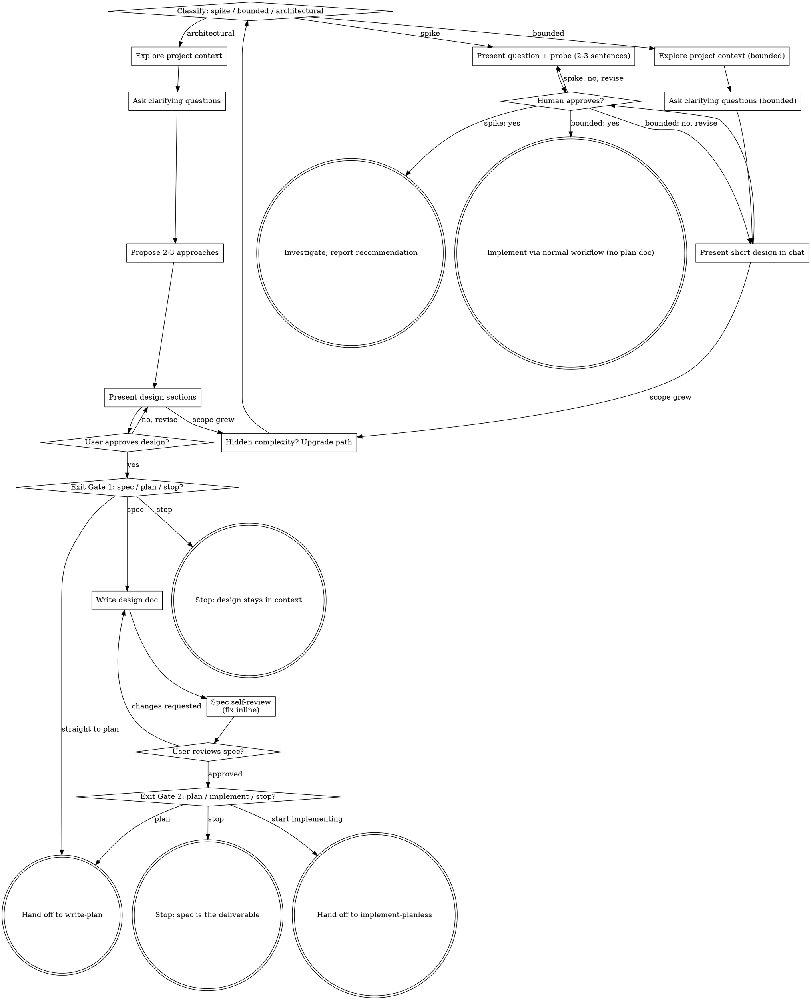

# Brainstorm Ideas Into Designs

Help turn ideas into fully formed designs and specs through natural collaborative dialogue.

Start by classifying how much process the request needs, then work
through your path: understand the context, refine the idea, present a
design, and get your human partner's approval.

<HARD-GATE>
Do NOT write any code, scaffold any project, or take any implementation
action until you have told your human partner what you intend and they
have approved it. This applies to EVERY task on EVERY path below — the
ceremony scales with the task; the approval gate never does.

This gate is about approval, not about which skill runs next. Where the
work goes after the design is the user's choice, offered at the two exit
gates below — this skill never chains into one on its own.
</HARD-GATE>

## Three Paths

Before your first question, classify the request and say the
classification out loud — "this looks bounded, so I'll present a short
design here rather than write a spec" — so your human partner can
override it:

- **Spike** — a feasibility question ("can we...", "is it possible...",
  "quick and dirty is fine") whose output is an answer, not code you
  keep. Present the question and what you'll try in 2-3 sentences, get
  a nod, then find out as cheaply as correctness allows. No design
  doc, no spec file. Report findings as a recommendation; anything you
  built stays labeled throwaway.
- **Bounded** — a well-scoped change to code that already exists in
  this repo: a new flag, a small endpoint, a one-file fix.
  Understanding the kind of app is not enough — bounded means the flow
  you are changing is already here to read. If there is no existing
  flow to change, the task is not bounded. Ask the clarifying
  questions that matter, present a short design IN CHAT (a few
  sentences to a few short paragraphs), and STOP. Implementation
  starts only after your human partner says yes to that design — a
  bounded task's approval is as hard a gate as an architectural
  one. No spec file, no implementation plan document.
- **Architectural** — new projects, new subsystems, changes that
  restructure how components fit together or alter interfaces others
  depend on. Follow the full process: questions, approaches, sectioned
  design — then offer Exit Gate 1 (below) rather than assuming a spec
  is wanted.

When in doubt between two paths, take the heavier one. The ratchet is
one-way: hidden complexity discovered mid-task upgrades the path —
stop, say so, and step up. Nothing downgrades mid-task.

## Anti-Pattern: "Too Simple To Need Approval"

Every path ends with your human partner approving your intent before
implementation. A todo list, a single-function utility, a config
change — the design may be two sentences in chat, but you MUST present
it and get approval. "Simple" tasks are where unexamined assumptions
cause the most wasted work. What scales with simplicity is the
artifact, never the approval.

## Red Flags

| Thought | Reality |
|---------|---------|
| "This is too simple to need a design" | Simple means a short design, not no design. Two sentences in chat, then approval. |
| "I'll call it bounded and skip the spec" | Reaching for a label to skip work IS the doubt — take the heavier path. |
| "It's bounded and the design is obvious — I'll start while they read it" | The gate is the approval, not the design's length. Present, then stop until you hear yes. |
| "I understand this kind of app, so it's bounded" | Bounded measures the repo, not your familiarity. A new project has no existing flow — it is architectural. |
| "The spike works, so I'll keep the code" | A spike's output is an answer. Keeping the code is a new request — classify it. |
| "It grew, but I'm almost done — no need to re-classify" | Hidden complexity upgrades the path mid-task. Stop and say so. |
| "They approved the spike, so the follow-up change is approved too" | Each task gets its own classification and its own approval. |

## Checklist

Classify first, announce the path, then create a task for each item on
your path and complete them in order.

**Spike:**
1. **Explore project context** — enough to frame the probe
2. **Present question + probe plan** — 2-3 sentences
3. **Get approval** — a nod is enough
4. **Investigate** — as cheaply as correctness allows
5. **Report findings** — a recommendation; label anything built as throwaway

**Bounded:**
1. **Explore project context** — check files, docs, recent commits
2. **Ask clarifying questions** — one at a time, the ones that matter
3. **Present short design in chat** — approach, files touched, testing
4. **Get approval** — STOP and wait for an explicit yes; presenting the design and starting in the same breath is skipping the gate
5. **Implement** — proceed with the normal development workflow (TDD applies); no plan document

**Architectural:**
1. **Explore project context** — check files, docs, recent commits
2. **Offer the visual companion just-in-time** — NOT upfront. The first time a question would genuinely be clearer shown than described, offer it then (its own message); on approval its browser tab opens for you. If no visual question ever arises, never offer it. See the Visual Companion section below.
3. **Ask clarifying questions** — one at a time, understand purpose/constraints/success criteria
4. **Propose 2-3 approaches** — with trade-offs and your recommendation
5. **Present design** — in sections scaled to their complexity, get user approval after each section
6. **Exit Gate 1** — ask what to do with the approved design: spec, straight to a plan, or stop (see *Exit Gates*)
7. **Write design doc** *(only if the user chose spec)* — save to the project-root `<project-root>/docs/specs/YYYY-MM-DD-<topic>-design.md` (`.claude/rules/docs-rules.md`) and commit there
8. **Spec self-review** *(spec path only)* — quick inline check for placeholders, contradictions, ambiguity, scope (see below)
9. **User reviews written spec** *(spec path only)* — ask user to review the spec file
10. **Exit Gate 2** *(spec path only)* — ask whether to write a plan from the spec, start implementing it, or stop (see *Exit Gates*)

Steps 7-10 exist only on the spec path. If Exit Gate 1 answered "plan" or "stop", the checklist ends at step 6 — do not create tasks you cannot complete.

## Process Flow

**Terminal states are path-bound.** Architectural: the design is the
deliverable, and where it goes next is the user's choice at the two exit
gates — spec, plan, implement, or stop. Do not invoke an implementation
skill on your own initiative at either gate. Bounded: after approval,
implementation proceeds directly through the normal development
workflow; no plan document. Spike: the terminal state is a reported
recommendation.

## The Process

The subsections below serve the bounded and architectural paths (a
spike stops at "present the probe, get a nod"). Sections from
**Exploring approaches** onward are architectural-path depth — for
bounded work, context plus a few questions plus a short in-chat design
is the whole process.

**Understanding the idea:**

- Check out the current project state first (files, docs, recent commits)
- Before asking detailed questions, assess scope: if the request describes multiple independent subsystems (e.g., "build a platform with chat, file storage, billing, and analytics"), flag this immediately. Don't spend questions refining details of a project that needs to be decomposed first.
- If the project is too large for a single spec, help the user decompose into sub-projects: what are the independent pieces, how do they relate, what order should they be built? Then brainstorm the first sub-project through the normal design flow. Each sub-project gets its own design cycle, and each reaches the exit gates on its own.
- For appropriately-scoped projects, ask questions one at a time to refine the idea
- Prefer multiple choice questions when possible, but open-ended is fine too
- Only one question per message - if a topic needs more exploration, break it into multiple questions
- Focus on understanding: purpose, constraints, success criteria

**Exploring approaches:**

- Propose 2-3 different approaches with trade-offs
- Present options conversationally with your recommendation and reasoning
- Lead with your recommended option and explain why
- YAGNI ruthlessly - remove unnecessary features from every approach and design

**Presenting the design:**

- Once you believe you understand what you're building, present the design
- Scale each section to its complexity: a few sentences if straightforward, up to 200-300 words if nuanced
- Ask after each section whether it looks right so far
- Cover: architecture, components, data flow, error handling, testing
- Be ready to go back and clarify if something doesn't make sense

**Design for isolation and clarity:**

- Break the system into smaller units that each have one clear purpose, communicate through well-defined interfaces, and can be understood and tested independently
- For each unit, you should be able to answer: what does it do, how do you use it, and what does it depend on?
- Can someone understand what a unit does without reading its internals? Can you change the internals without breaking consumers? If not, the boundaries need work.
- Smaller, well-bounded units are also easier for you to work with - you reason better about code you can hold in context at once, and your edits are more reliable when files are focused. When a file grows large, that's often a signal that it's doing too much.

**Working in existing codebases:**

- Explore the current structure before proposing changes. Follow existing patterns.
- Where existing code has problems that affect the work (e.g., a file that's grown too large, unclear boundaries, tangled responsibilities), include targeted improvements as part of the design - the way a good developer improves code they're working in.
- Don't propose unrelated refactoring. Stay focused on what serves the current goal.

## After the Design (architectural path)

The brainstorm is done once the user has approved the design in chat.
Everything below is optional, and which of it happens is the user's call
at two gates. Never skip a gate by assuming the next artifact is wanted.

### Exit Gate 1 — after the design is approved, before writing anything

The design exists in this conversation and the user has approved it. Ask
what it should become:

> "Design approved. Three ways to go from here:
>
> **1. Write the design spec** — I write it to the project-root `docs/specs/`, self-review it, and you review it. Worth it when the design is large, needs to outlive this session, or others will read it.
>
> **2. Straight to an implementation plan** — I skip the spec and hand the design as it stands to the `write-plan` skill. Faster; the design lives only in this conversation and in the plan.
>
> **3. Stop here** — the design stays in context. You take it from here, or call whatever comes next yourself.
>
> Which?"

| Answer | Do this |
|---|---|
| Write the spec | Continue to **Documentation** below |
| Straight to a plan | Use the `write-plan` skill, handing it the approved design from this conversation as the spec |
| Stop here | Stop. Do not write the spec, the plan, or any code. |

**Documentation:**

- Resolve the project root and write the validated design (spec) to
  `<project-root>/docs/specs/YYYY-MM-DD-<topic>-design.md`. That `docs/specs/` is shared by every
  worktree. Resolution, the `workspaces/` prohibition and the commit target are in
  `.claude/rules/docs-rules.md`. Read it before writing the file.
  - (A spec location the user names in the conversation overrides this default)
- Commit the design document in the repository owning the project root: `git -C <project-root>`

**Spec Self-Review:**
After writing the spec document, look at it with fresh eyes:

1. **Placeholder scan:** Any "TBD", "TODO", incomplete sections, or vague requirements? Fix them.
2. **Internal consistency:** Do any sections contradict each other? Does the architecture match the feature descriptions?
3. **Scope check:** Is this focused enough for a single implementation plan, or does it need decomposition?
4. **Ambiguity check:** Could any requirement be interpreted two different ways? If so, pick one and make it explicit.

Fix any issues inline. No need to re-review — just fix and move on.

**For a large or high-stakes spec,** follow the self-review with an
independent pass: dispatch a `general-purpose` subagent using the template
at [spec-document-reviewer-prompt.md](spec-document-reviewer-prompt.md). A
fresh reader catches gaps you will read past in your own draft.

**User Review Gate:**
After the spec review loop passes, ask the user to review the written spec:

> "Spec written and committed to `<absolute path>`. Please review it and let me know if you want any changes."

Wait for the user's response. If they request changes, make them and re-run
the spec review loop. Only continue once the user approves.

### Exit Gate 2 — after the spec is written and reviewed

The spec is approved on disk. Ask what happens to it next:

> "Spec approved at `<absolute path>`. Three ways to go:
>
> **1. Write the implementation plan** — I hand the spec to the `write-plan` skill, which turns it into task-by-task steps in `docs/plans/`. Worth it when the work is long, splits into independent tasks, or someone else will execute it.
>
> **2. Start implementing** — I hand the spec to the `implement-planless` skill and build from it in this session. Faster. No plan document, and the review happens on the finished change.
>
> **3. Stop here** — the spec is the deliverable. You pick it up whenever, in whatever session.
>
> Which?"

| Answer | Do this |
|---|---|
| Write the plan | Use the `write-plan` skill, pointed at the spec file |
| Start implementing | Use the `implement-planless` skill, pointed at the spec file and the design in this conversation. It restates goal, done criterion and scope for confirmation before building. |
| Stop here | Stop. Do not write the plan or any code. |

If the work turns out to be larger than `implement-planless` handles, that
skill escalates to `write-plan` on its own. Do not pre-empt it here.

**At both gates:** stopping is a legitimate outcome, not a failure. A
design in context and a spec on disk are each complete deliverables. If
the user does not answer, treat it as *stop* rather than picking a
default and continuing.

## Visual Companion

A browser-based companion for showing mockups, diagrams, and visual options during brainstorming. Available as a tool — not a mode. Accepting the companion means it's available for questions that benefit from visual treatment; it does NOT mean every question goes through the browser.

**Offering the companion (just-in-time):** Do NOT offer it upfront. Wait until a question would genuinely be clearer shown than told — a real mockup / layout / diagram question, not merely a UI *topic*. The first time that happens, offer it then, as its own message:
> "This next part might be easier if I show you — I can put together mockups, diagrams, and comparisons in a browser tab as we go. It's still new and can be token-intensive. Want me to? I'll open it for you."

**This offer MUST be its own message.** Only the offer — no clarifying question, summary, or other content. Wait for the user's response. If they accept, start the server with `--open` so their browser opens to the first screen automatically. If they decline, continue text-only and don't offer again unless they raise it.

**Per-question decision:** Even after the user accepts, decide FOR EACH QUESTION whether to use the browser or the terminal. The test: **would the user understand this better by seeing it than reading it?**

- **Use the browser** for content that IS visual — mockups, wireframes, layout comparisons, architecture diagrams, side-by-side visual designs
- **Use the terminal** for content that is text — requirements questions, conceptual choices, tradeoff lists, A/B/C/D text options, scope decisions

A question about a UI topic is not automatically a visual question. "What does personality mean in this context?" is a conceptual question — use the terminal. "Which wizard layout works better?" is a visual question — use the browser.

If they agree to the companion, read the detailed guide before proceeding:
[visual-companion.md](visual-companion.md)
